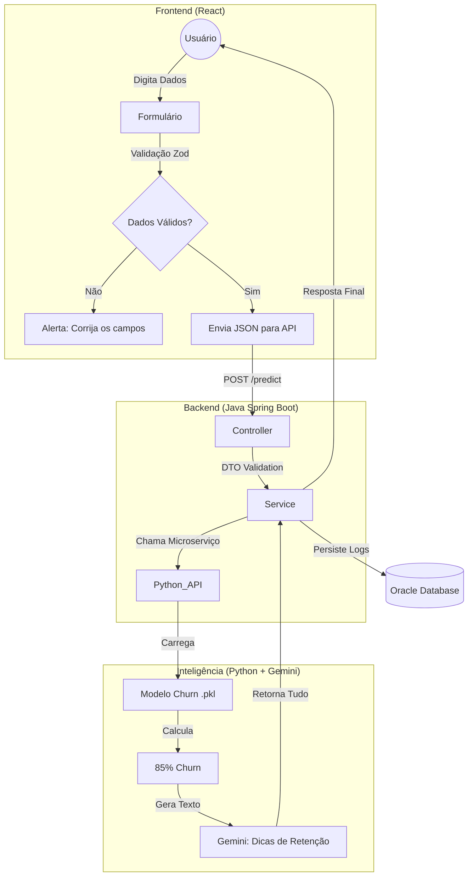

# 🚀 SQUAD 17: NEXT HORIZON | PROJETO CHURNINSIGHT
> **Hackathon ONE - No Country 2025** | *Data Driven & AI Solutions*


---

## 📖 1. O CENÁRIO: NOSSA MISSÃO DE NEGÓCIO
*Não estamos apenas codando; estamos salvando uma empresa.*

Imagine que fomos contratados por uma **Gigante de Telecomunicações**. Eles têm um problema sangrento:
> "Todo mês, colocamos 1.500 novos clientes para dentro, mas perdemos 750 (Churn). Nosso sistema atual é cego; ele só nos avisa quando o cliente já cancelou."

**Nossa Missão como Startup Especialista:**
Nós não vamos apenas entregar um software. Nós vamos entregar uma **Bola de Cristal**.
1.  **O Básico (MVP):** Nossa API vai olhar para o histórico (atrasos, uso) e dizer: *"Cuidado! O cliente João tem 85% de chance de sair."*
2.  **O "Wow Factor" (Nosso Diferencial):** Para superar as expectativas e garantir contratos futuros, vamos entregar algo que eles não pediram, mas vão amar. Além do alerta, entregaremos um **Plano de Retenção via IA Generativa**. O sistema dirá ao atendente: *"Ofereça 10% de desconto e um upgrade de dados agora para salvar o João."*

---

## 📅 2. NOSSO CRONOGRAMA MACRO (6 SEMANAS)
[cite_start]*Baseado no Regulamento Oficial* [cite: 900, 40]

* **Semana 1 (Atual):** Setup, Arquitetura, EDA (Dados) e Esqueleto API.
* **Semana 2:** MVP Funcional (API Java + Modelo Simples + Front Básico).
* **Semana 3:** Integração Total e Deploy na Nuvem (OCI).
* **Semana 4:** Implementação do Diferencial (Relatório IA com Gemini).
* **Semana 5:** Testes, Refinamento e Feedback 360º.
* **Semana 6:** Gravação do Vídeo Demo e preparação para o Demo Day (20/01).

---

## ⚙️ 3. ARQUITETURA DE SOFTWARE

### Backend (Java Spring Boot)
* **Arquitetura:** MVC (Model-View-Controller) com Camadas (Controller -> Service -> Repository).
* **Segurança:** Validação de input (DTOs com Bean Validation).
* **Banco de Dados:** MySQL (Hospedado na OCI).

### Data Science (Python)
* **Modelo:** Classificação Supervisionada (Random Forest/Logistic Regression).
* **Entrega:** Microserviço API (Flask/FastAPI) que expõe o modelo `.pkl` para o Backend.

### Frontend (React)
* **Interface:** Dashboard Administrativo para gestores visualizarem o risco de churn.

*"Nossa meta não é apenas entregar, é ser a referência técnica do Hackathon."*
---

## 🛠️ 3.1 ARQUITETURA TÉCNICA (FLUXO DETALHADO)
*Como a mágica acontece por baixo do capô*

### O Fluxo de Inteligência
1.  **O Gatilho:** O modelo de DS detectou **Churn > 70%**.
2.  **A Ação Agêntica:** O Backend Java não apenas devolve o número. Ele pega os dados desse cliente crítico e envia para o Gemini.
3.  **O Prompt do Mestre:** *"Aja como um Gerente de Sucesso. O cliente João tem 85% de chance de sair por atrasos. Gere um plano de retenção de 3 passos."*
4.  **A Entrega:** O Frontend exibe o "Sinal Vermelho" e o "Plano de Ação".

### Diagrama de Integração (Mermaid)


---

## 💻 4. CONTRATO DE API & REQUISITOS TÉCNICOS
🛡️ Engenharia Defensiva (Validação)
Frontend: Usaremos Zod para impedir dados inválidos antes do envio.

Backend: Usaremos Bean Validation para segurança da API.

📡 Payload de Integração (JSON)
Acordo entre Backend e Data Science

Entrada (Request): POST /predict

```JSON

{
  "tempo_contrato_meses": 12,
  "atrasos_pagamento": 2,
  "uso_mensal": 14.5,
  "plano": "Premium"
}
```
Saída (Response): 200 OK

```JSON

{
  "previsao": "Vai cancelar",
  "probabilidade": 0.81,
  "nivel_risco": "ALTO",
  "plano_acao_ia": "Cliente sensível a preço. Oferecer desconto de 15% imediatamente."
}
```
## 5. 📋 Entregáveis por Time (MVP Semana 1-2)
🧬 Data Science (Python)
[ ] Notebook com Análise Exploratória (EDA).

[ ] Modelo treinado (Logistic Regression ou Random Forest).

[ ] Arquivo do modelo serializado (model.joblib).

[ ] Script Python para servir o modelo (API simples).

☕ Backend (Java Spring Boot)
[ ] API REST com endpoint /predict.

[ ] Validação de dados de entrada.

[ ] Comunicação com o serviço Python.

[ ] Dockerfile da aplicação.

🎨 Frontend (React)
[ ] Tela de Dashboard Simples.

[ ] Formulário para testar previsão.

[ ] Visualização do resultado (Alerta Vermelho/Verde).

---

## 🚨 6. ROTINA E OBRIGAÇÕES (PARA APROVAÇÃO)
[cite_start]*Regras do Guia da Plataforma* [cite: 48, 49, 100-105]

1.  **Daily Meeting (18:00h):** Alinhamento rápido de no mínimo 15min. (Quem não puder, avise no chat).
2.  **Sprint Demo (Quinta-feira):** Apresentação obrigatória do progresso da semana e envio dos entregáveis na plataforma.
3.  **Registro na Plataforma:** **CRUCIAL.** Entre todo dia na aba "Cronograma" e marque suas tarefas como concluídas. Sem isso, você é eliminado.
4.  **Comunicação:** Usem o chat da No Country para registrar presença.

---

## 🧬 7. DIRETRIZES DE DATA SCIENCE (ANTI-DESCLASSIFICAÇÃO)
*Regras cruciais para garantir a validade técnica do nosso modelo.*

### 🚨 A "Armadilha" do Dataset (Data Leakage)
Para evitar que nosso projeto seja invalidado por "vício de dados" ou vazamento de resposta, o time de Dados deve seguir rigorosamente:

1.  **Sanitização de Colunas:** Remover qualquer coluna que entregue a resposta ("Churn Reason", "Churn Score" pré-calculado por terceiros). O modelo deve aprender com o *comportamento* (pagamentos, uso), não com a resposta pronta.
2.  **Atenção ao CLTV:** Se usarmos *Lifetime Value*, devemos garantir que ele seja calculado com dados históricos *anteriores* ao evento de churn. Se o dataset já vier com isso pronto, precisamos validar se não é um dado "viciado".
    * *Regra de Ouro:* "Eu teria esse dado no momento da predição?" Se a resposta for não, remova a coluna.

### 📓 Ambiente de Desenvolvimento Obrigatório (Google Colab)
[cite_start]Conforme o Regulamento [cite: 785-786, 940], a entrega oficial de Data Science **NÃO** é apenas o modelo final, mas a **história da análise**.

* **Ferramenta:** Todo o desenvolvimento (EDA, Treino, Teste) deve ser feito no **Google Colab**.
* **Por que:** O Colab permite que os avaliadores rodem o código na nuvem sem configurar ambiente local.
* **Entregável:** O arquivo `.ipynb` (Notebook) deve estar bem documentado (com textos explicando o raciocínio em cada bloco de código) e o link deve constar no `README.md` oficial.

> **Meta:** Nosso notebook deve ser uma "aula" de como chegamos na previsão, provando que não usamos atalhos proibidos.
---

## 🤝 8. COMO CONTRIBUIR (GIT FLOW)
Liderança Técnica: Philipe Oliveira

NUNCA commitar direto na main. A main é sagrada.

Crie uma branch para sua task: git checkout -b feature/nome-da-task

Faça seus commits pequenos e frequentes.

Abra um Pull Request (PR) e avise no chat.

Aguarde o Code Review antes do Merge.

---

## 🔗 9. LINKS E RECURSOS
* [📄 Regulamento Oficial (PDF)](https://empresas.alura.com.br/hubfs/G8%20-%20BRA%20-%20Regulamento%20do%20Hackathon%20ONE%20V2%20%E2%80%93%20No%20Country%202025.pdf)
* [🗓️ Guia da Plataforma (PDF)](https://drive.google.com/file/d/1eOZYn4Fb5pgX7xmrdcmSjQjIqd6VAnnm/view?pli=1)
* [💻 Repositório GitHub](https://github.com/PhilipeOliveiraS/ChurnInsight-Squad17)
* [🎨 Design (Figma)](LINK)

*> Superar a expectativa do cliente é o que transforma código em negócio." - NEXT HORIZON Team*